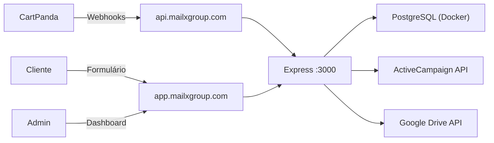

# MailX — Walkthrough

## O que foi construído

Pipeline de automação de email marketing em **TypeScript/Node.js** que integra **CartPanda → ActiveCampaign**, com formulário de onboarding para clientes e **Dashboard Admin Visual**.

## Arquitetura



## Estrutura do projeto

```
mailx/
├── src/
│   ├── index.ts              ← Express server
│   ├── admin/
│   │   ├── dashboard.html    ← [NOVO] Interface visual com pipeline
│   │   └── router.ts         ← API expandida (stats, bootstrap trigger)
│   ├── setup/
│   │   ├── bootstrap-service.ts ← [NOVO] Lógica de setup extraída
│   │   └── bootstrap.ts      ← CLI wrapper
│   ├── webhooks/             ← Handlers de eventos
│   ├── services/             ← API clients (AC, CartPanda)
│   └── db/database.ts        ← PostgreSQL connection
├── deploy.sh                 ← [NOVO] Script de instalação VPS automática
├── nginx.conf                ← [NOVO] Config do Nginx
├── docker-compose.yml
└── .env.example
```

## Documentação Adicional

> 📘 **Guia de Configuração**: Veja [configuration_guide.md](file:///C:/Users/Pichau/.gemini/antigravity/brain/5e835e3e-2c5c-4eed-949e-0d4c8a4cb42b/configuration_guide.md) para detalhes completos sobre DNS, domínios e integrações externas.

## Dashboard Admin (Human in the Loop)

Acesse `/admin` para gerenciar tudo visualmente:

1. **Pipeline de Clientes**: Visualiza status (Pendente → Configurando → Ativo)
2. **Botão ⚡ Configurar AC**: Roda o bootstrap com 1 clique (sem CLI)
3. **Feed de Webhooks**: Monitora eventos em tempo real
4. **Stats**: Verificação de saúde do sistema

## Como fazer deploy na VPS (Hostinger KVM2)

A KVM2 (2 vCPU / 8GB RAM) é excelente para este projeto.

1. **Acesse sua VPS** via SSH (`ssh root@ip`)
2. **Suba os arquivos** (via SFTP ou Git) para `/root/mailx`
3. **Rode o script de instalação**:
   ```bash
   cd /root/mailx
   chmod +x deploy.sh
   ./deploy.sh
   ```
   _O script instala Node.js, Docker, PM2, Nginx, configura SSL e sobe o app._

## Próximos passos

1. Contratar VPS e rodar `deploy.sh`
2. Configurar DNS (registros exibidos no dashboard)
3. Enviar link de onboarding para o cliente
